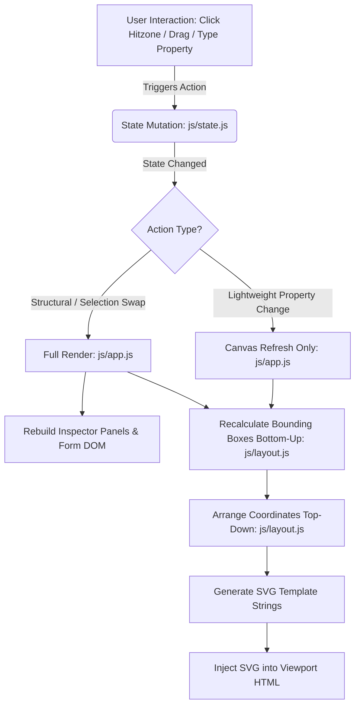

# Flowchart Studio: Software Architecture & Specifications

This document outlines the software architecture and module layout for the visual programming environment **Flowchart Studio**. The application is structured in pure ES6 JavaScript modules with a unidirectional rendering cycle.

---

## 1. Project Directory Structure

The files are organized modularly as follows:

- `web/index.html` — HTML layout shell. Contains header tabs, the File operations dropdown, properties inspector sidebar, context popups, dialog modals, and the base SVG viewport.
- `web/index.css` — Premium dark theme styling, glassmorphism panel styles, dropdown animation tokens, and hover transition indicators.
- `web/js/state.js` — State layer managing the Abstract Syntax Tree (AST), mutations, subroutines, parameter list states, selection pointers, and serialization (export/import).
- `web/js/layout.js` — Geometry layout engine calculating recursive bottom-up dimensions, top-down coordinate arrangements, and pure SVG element rendering.
- `web/js/app.js` — Main controller that acts as a coordinator, managing global SVG pointer event delegations (clicking, drag-panning, scroll-zooming, note dragging/resizing), on-demand library loading, and synchronizing forms.
- `server.js` — Zero-dependency HTTP server that resolves ES6 module imports with proper MIME headers to bypass browser CORS policies.
- `package.json` — NPM configuration containing start/dev launch scripts.

---

## 2. Rendering Cycle & Data Flow

The editor is powered by a **State-Driven Unidirectional Flow**. When a state mutation is requested, the application state changes, which automatically notifies the coordinator to trigger a layout calculation and redraw the SVG canvas.



### 2.1 The Focus Caret Problem Solved
If the inspector form inputs were destroyed and recreated on every keystroke, the user would lose cursor focus. To prevent this, we divide updates:
- **`render(state, "structure")`**: Full update called on node insertion, deletion, procedure swapping, and selection changes. This updates the inspector.
- **`render(state, "edit")`**: Lightweight update called while the user is typing in property forms. It only recalculates coordinates and updates the SVG drawing, leaving the inspector inputs untouched.

### 2.2 Performance Optimizations
- **Scoped Icon Scans**: To prevent expensive layout thrashing and DOM traversals, Lucide icon generation is scoped directly to modified elements (`lucide.createIcons({ node: container })`) instead of checking the entire page.
- **On-Demand Dependency Loading**: The heavy `jsPDF` package is loaded dynamically from CDN only when the user first triggers a PDF export, keeping the initial page-load and file-import operations fast and lightweight.

---

## 3. Layout & Graphic Engine Specifications

The flowchart is rendered inside a scalable SVG viewport. Each node's layout is computed using a two-pass recursive layout engine:

### 3.1 Pass 1: Measure (Bottom-Up)
Calculates bounding box dimensions (`w` and `h`) and the horizontal alignment point (`xAnchor`) where the vertical flowline intersects the node.
- **Sequential Nodes** (*Start, End, Input, Output, Assignment, Call*): Have a base width of `180px`. Height is computed dynamically using text length heuristics (`estimateHeight`).
- **Conditionals** (*If, While, Do-While*): Recursively measure nested branches/loop bodies. Spacing is calculated horizontally by adding safety margins between the branch bounding boxes (`sLeft`, `sRight`). Diamond height scales with condition length.
- **Sticky Notes**: Rendered as free-placement notes, supporting dynamic width/height drag adjustments.

### 3.2 Pass 2: Arrange (Top-Down)
Given a starting root coordinate, sets absolute coordinates `x` and `y` for each block and branches, aligning their `xAnchor` elements with the main parent flowline center.

### 3.3 Vector Compatibility (No `<foreignObject>`)
To support loading exported diagrams into standard vector software (such as GIMP, LibreOffice Draw, Inkscape, or Adobe Illustrator) where HTML wrappers are not supported:
- We do **not** use `<foreignObject>` elements for text rendering.
- All node labels, conditional statements, and sticky note contents are rendered using native SVG `<text>` elements.
- Text wrapping is computed programmatically (`wrapText`) at word boundaries.
- Centered text blocks calculate lines and vertical offsets mathematically:
  $$y_i = y_{\text{center}} - \frac{N - 1}{2} \cdot \text{spacing} + i \cdot \text{spacing}$$
- Text lines use `text-anchor="middle"` and `dominant-baseline="central"` to guarantee vertical and horizontal alignment compatibility.

---

## 4. Export Pipelines

- **JSON Export**: Downloads the entire application state (all procedures, parameters, body ASTs, and sticky notes) as a JSON backup file.
- **PDF Export**: Swaps procedures in the background to calculate bounds for each diagram, rendering every flow to a dedicated, custom-sized page in a single consolidated PDF document. Temporary interactive overlays (hitzone buttons, note resize handles, and the floating Variable Watcher panel) are hidden prior to canvas generation, and canvas rendering is base64-encoded to prevent origin taints.
- **SVG Export**: Exports the active procedure screen as a standalone, portable, transparent-background SVG file, with styling rules embedded inline. Interactive hitzones, note resize handles, and the Variable Watcher are temporarily hidden to clean up the exported vector graphic.

---

## 5. How to Run the Application

Since browsers block loading ES6 modular scripts via the `file://` protocol, you should serve the workspace using the local server:

1. Open a terminal in the project directory.
2. Run the start script:
   ```bash
   npm run dev
   ```
3. Open your browser and navigate to:
   **[http://localhost:3000](http://localhost:3000)**

You can now build visual flowcharts, insert blocks via interactive connection hitzones, switch between subroutines, inspect/edit blocks, and export/import your work.
