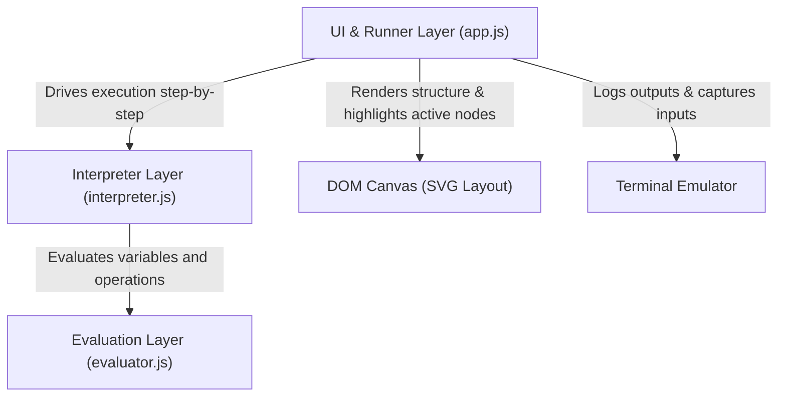

# Flowchart Execution Engine: Architecture & Design Decisions

This document details the architecture, design choices, and implementation details of the Flowchart Studio Execution Engine. It covers the UI components, variable scope isolation, expression evaluation, asynchronous loop execution, and key performance optimizations.

---

## 1. Architectural Overview

The execution engine is split into three decoupled layers:



1. **Evaluation Layer (`evaluator.js`):** Standardizes expression evaluations using a JavaScript syntax subset, resolving variable scopes safely.
2. **Interpreter Layer (`interpreter.js`):** A generator-based (`function*`) AST walker that manages the call stack, variable frames, and yields execution control states (e.g., highlights, inputs, outputs, terminations) back to the runner.
3. **UI & Runner Layer (`app.js`):** Orchestrates the run loops, drives the interpreter generator via timeouts, updates control bar states, renders highlights, and manages terminal input/output interaction.

---

## 2. UI Design Decisions

To make flowcharts executable while maintaining a clean workspace, the following design guidelines were implemented:

### Switchable Sidebar Panel (Dual-Purpose Layout)
* **Design Rationale:** Showing both the Properties Inspector and the Run Console at the same time restricts workspace space. During execution, users care about console outputs rather than configuring block fields.
* **Solution:** The left panel serves a dual purpose. Clicking the **Terminal Console** button shifts the panel view into terminal mode, while selecting blocks toggles it back into inspect mode.
* **Resizable Panel Width:** To accommodate wide logs or verbose print strings, the sidebar panel width is fully adjustable via a drag handler.

### Unified In-Place Terminal Console
* **In-place Inputs:** Rather than using blocking browser `prompt()` dialogs, the console renders input lines inline. The terminal pauses and prints a blue input prompt (e.g., `Enter age: [__]`), locking execution until the user hits `Enter`. Once submitted, the input box is replaced by a static text badge in the log history.
* **Strict Type Coloring:**
  * <span style="color: #64748b">Slate Gray</span>: System status logs (e.g., execution started, clear, paused).
  * <span style="color: #10b981">Emerald Green</span>: Program output strings.
  * <span style="color: #ef4444">Bright Crimson Red</span>: Runtime expression errors and stack crashes.

---

## 3. Variable Handling & Name Shadowing

To mimic professional programming languages, the execution engine enforces strict **lexical frame isolation**:

### Local Stack Frames
Every procedure execution (including `main`) is pushed as a frame onto a private `callStack`:
```javascript
this.callStack.push({
  procedureName: name,
  localScope: localScope // Contains local parameters and variables
});
```

### Frame Isolation & Shadowing
* **No Variable Leaking:** `getCurrentScope()` resolves only the variables within the active top frame's `localScope`. Subroutines cannot read or modify variables in the caller's frame.
* **Name Shadowing:** If a subroutine parameter has the same name as a variable in the caller function, it operates on a separate memory slot in its own local stack frame. Modifications to the parameter do not affect the caller's variable.
* **Global Output Register (`_result`):** To allow calls to return values without polluting lexical frames, a single global register `_result` is updated on returns. Caller blocks can read this register to retrieve the output of the last completed Call Block.

---

## 4. Syntax & Expression Evaluation

The evaluation of expressions (such as assignments, loops, and conditions) is performed using the `JSExpressionEvaluator`:

* **JavaScript Syntax:** Expression strings (e.g. `x > 5`, `"Count: " + count`) are evaluated using a sandboxed JavaScript context mapped against the active local frame scope.
* **HTML Input Escaping:** When rendering node values in the properties panel, all values are wrapped in `escapeHtml()` helper calls:
  ```javascript
  value="${escapeHtml(node.expression || '')}"
  ```
  This prevents HTML parsing bugs where string literals containing double quotes (e.g., `"Hello World"`) or angle brackets (e.g., `x < y`) collide with form field value boundaries.

---

## 5. Asynchronous Execution Control

Running step-by-step executions at adjustable speeds without freezing the browser tab requires careful asynchronous task scheduling:

### Generator-Based Walking
The interpreter uses a JavaScript Generator (`function*`) to walk the flowchart block lists. 
Each execution step pauses at a block, yields its action, and awaits the next trigger:
```javascript
// Example: While block iteration yields highlights to allow UI rendering
while (true) {
  yield { type: "HIGHLIGHT", nodeId: node.id };
  const cond = this.evaluator.evaluate(node.condition, this.getCurrentScope());
  if (!cond) break;
  yield* this.executeBlockList(node.loopBody);
}
```

### Event-Loop Friendly Runner
* **Non-Blocking Timer:** The runner schedules step iterations using `setTimeout(runStep, delay)`. 
* **State Resets:** Clicking **Stop** immediately cancels any active timeout, sets `interpreter = null`, and clears DOM highlight classes.
* **Lucide Icon Optimization (Stop Lag Fix):**
  Previously, calling `lucide.createIcons()` on the whole document during every execution step consumed excessive CPU cycles, backing up the browser event loop and delaying Stop clicks. 
  By targeting only the changed icon node (`runBtn`), execution runs at maximum speed and stops instantly on click:
  ```javascript
  if (runBtn.innerHTML !== prevHTML && window.lucide) {
    window.lucide.createIcons({ node: runBtn });
  }
  ```

### Carriage & Formatting Controls
* **Newline Flag (`newline`):** The output block features a "New Line" toggle. When checked (`true`), the console begins a new div for subsequent logs. When unchecked (`false`), subsequent outputs are appended directly inline into the text node of the active output line.
* **String Formatting:**
  * Tab characters (`\t`) are expanded to 8 spaces: `\t` $\rightarrow$ `        `.
  * Embedded newlines (`\n`) are split and formatted as consecutive console lines, respecting the trailing inline flag.
  * **Type Segregation:** Inline appends are restricted to matching message types (e.g., output text will never append into system logs or input prompts, forcing a new line instead).
